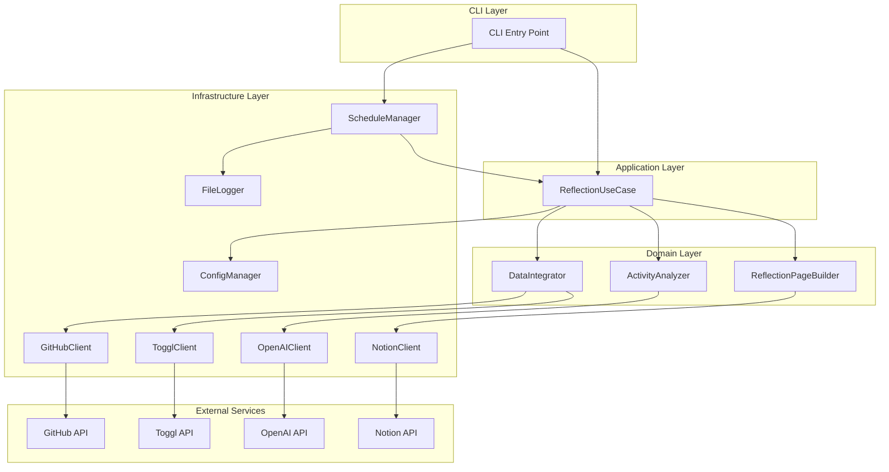
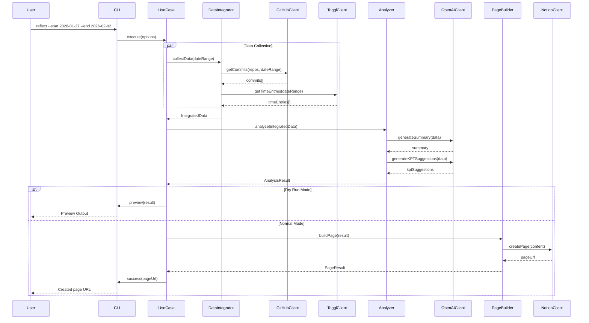
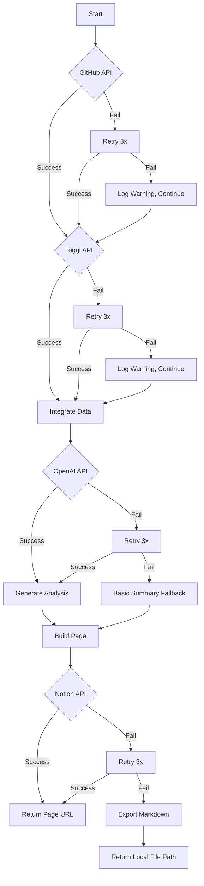
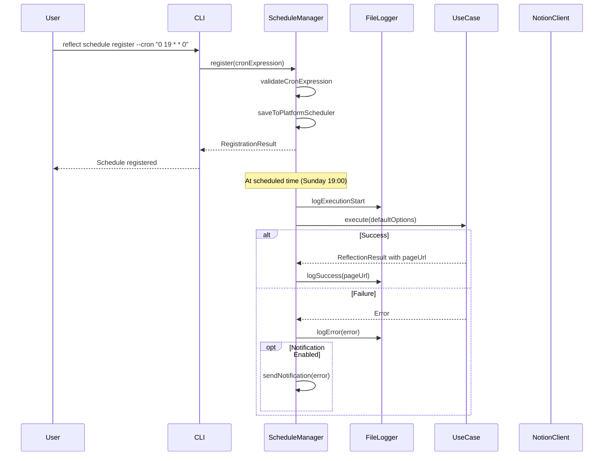
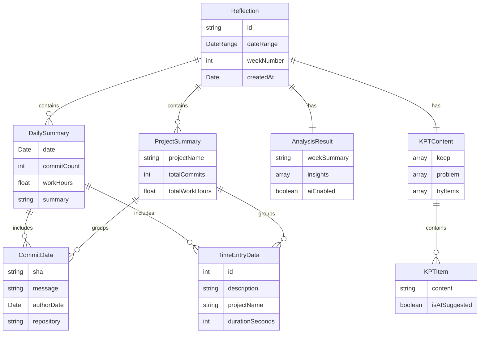

# Design Document: 週次振り返りシステム

## Overview

**Purpose**: 本システムは、開発者の週次振り返りプロセスを自動化し、GitHubコミット履歴とToggl打刻データを統合してAI分析を行い、Notionに構造化されたKPT形式の振り返りページを自動生成する。

**Users**: 個人開発者およびチーム開発者が、週次の活動振り返りと自己成長追跡に利用する。

**Impact**: 手動での振り返り作業を自動化し、データ駆動型の振り返りプロセスを実現する。複数データソースの統合とAI分析により、従来の主観的な振り返りを補完する客観的な洞察を提供する。

### Goals
- GitHubとTogglのデータを自動取得し、週次活動の全体像を可視化する
- ChatGPT（OpenAI API）による活動サマリーとKPT提案の自動生成
- Notionへの振り返りページ自動作成による一元管理の実現
- シンプルなCLIインターフェースによる手軽な実行
- スケジュール実行による定期的な自動振り返り生成

### Non-Goals
- リアルタイムのデータ同期（バッチ処理のみ）
- Webインターフェースの提供
- 複数ユーザーの同時利用（シングルユーザーCLI）
- Notion以外の出力先（Markdown出力はフォールバックのみ）
- GitHubおよびToggl以外のデータソース統合

## Architecture

### Architecture Pattern & Boundary Map

**Selected Pattern**: Clean Architecture（軽量版）

複数の外部API（GitHub, Toggl, OpenAI, Notion）を統合するため、各APIクライアントをインフラ層に分離し、ドメインロジックとの疎結合を実現する。詳細な比較検討は`research.md`参照。



**Architecture Integration**:
- **Selected pattern**: Clean Architecture - ドメインロジックと外部サービスの分離により、テスタビリティと保守性を確保
- **Domain/feature boundaries**: CLI層（ユーザーインターフェース）、Application層（ユースケース調整）、Domain層（ビジネスロジック）、Infrastructure層（外部サービス連携）
- **New components rationale**: 各外部APIに対応するClientコンポーネントと、データ統合・分析を担うDomainコンポーネントを設置
- **Steering compliance**: 型安全性重視、疎結合設計、エラーハンドリングの段階的回復

### Technology Stack

| Layer | Choice / Version | Role in Feature | Notes |
|-------|------------------|-----------------|-------|
| CLI | Commander.js ^12.0 | コマンドライン引数解析、オプション管理 | 軽量で学習コスト低 |
| Runtime | Node.js ^20 LTS | JavaScript実行環境 | 長期サポート版 |
| Language | TypeScript ^5.4 | 型安全な実装 | 厳格な型チェック有効化 |
| HTTP Client | axios ^1.7 | REST API通信 | インターセプター、リトライ対応 |
| Configuration | dotenv ^16.4, cosmiconfig ^9.0 | 環境変数・設定ファイル読込 | 複数設定ソース統合 |
| Logging | pino ^9.0 | 構造化ログ出力 | JSON形式、レベル制御 |
| Progress | ora ^8.0, cli-progress ^3.12 | 進捗表示 | スピナー、プログレスバー |
| Scheduling | node-cron ^3.0 | cron互換スケジュール | 軽量、依存少 |

## System Flows

### Main Reflection Flow



**Key Decisions**:
- データ収集（GitHub/Toggl）は並列実行で時間短縮
- OpenAI APIはサマリーとKPT提案を順次生成（プロンプト最適化のため）
- ドライランモードで実際のNotion作成前にプレビュー可能

### Error Recovery Flow



**Key Decisions**:
- 各API呼び出しで3回リトライ（指数バックオフ）
- Graceful degradation: 部分的失敗でも処理続行
- Notionエラー時はMarkdownファイルへフォールバック

### Schedule Execution Flow



**Key Decisions**:
- スケジュール登録はOS標準のスケジューラ（launchd/systemd/cron）と連携
- 実行ログは設定された出力先にファイル出力
- 失敗時はオプションの通知先に通知可能
- 成功時はNotionページURLをログに記録

## Requirements Traceability

| Requirement | Summary | Components | Interfaces | Flows |
|-------------|---------|------------|------------|-------|
| 1.1, 1.2, 1.3 | GitHubコミット取得、フィールド抽出、エラー処理 | GitHubClient | IGitHubClient | Main Flow |
| 1.4 | コミットなし通知 | GitHubClient, CLI | IGitHubClient | Main Flow |
| 1.5 | 複数リポジトリ対応 | GitHubClient, ConfigManager | IGitHubClient, IConfigManager | Main Flow |
| 2.1, 2.2, 2.3 | Togglデータ取得、フィールド抽出、エラー処理 | TogglClient | ITogglClient | Main Flow |
| 2.4 | 打刻データなし通知 | TogglClient, CLI | ITogglClient | Main Flow |
| 2.5 | プロジェクト別・日別集計 | DataIntegrator | IDataIntegrator | Main Flow |
| 3.1, 3.2 | データ統合、日別サマリー生成 | DataIntegrator, Analyzer, OpenAIClient | IDataIntegrator, IAnalyzer, IOpenAIClient | Main Flow |
| 3.3, 3.4, 3.5 | 活動要約、相関分析、プロジェクト別集計 | Analyzer, OpenAIClient | IAnalyzer, IOpenAIClient | Main Flow |
| 3.6, 3.7 | OpenAIエラー時フォールバック、部分データ処理 | Analyzer, UseCase | IAnalyzer | Error Recovery Flow |
| 4.1, 4.2, 4.3, 4.4 | Notionページ作成、タイトル、セクション生成 | PageBuilder, NotionClient | IPageBuilder, INotionClient | Main Flow |
| 4.5 | Notionエラー時Markdownフォールバック | PageBuilder, NotionClient | IPageBuilder, INotionClient | Error Recovery Flow |
| 4.6 | ページURL表示 | NotionClient, CLI | INotionClient | Main Flow |
| 5.1, 5.2, 5.3, 5.4 | KPTセクション生成 | PageBuilder | IPageBuilder | Main Flow |
| 5.5 | AI KPT提案生成 | Analyzer, OpenAIClient | IAnalyzer, IOpenAIClient | Main Flow |
| 6.1, 6.2 | 過去振り返りリンク、前週Try参照 | PageBuilder, NotionClient | IPageBuilder, INotionClient | Main Flow |
| 6.3 | 活動量推移サマリー | Analyzer | IAnalyzer | - |
| 6.4 | 週番号・タグ自動付与 | PageBuilder | IPageBuilder | Main Flow |
| 6.5 | 前週ページなし時の処理 | PageBuilder | IPageBuilder | Main Flow |
| 7.1-7.4 | API認証情報管理 | ConfigManager | IConfigManager | - |
| 7.5 | ChatGPTモデル設定 | ConfigManager | IConfigManager | - |
| 7.6, 7.7 | 期間・リポジトリ設定 | ConfigManager | IConfigManager | - |
| 7.8, 7.9 | スケジュール曜日・時刻、ログ出力先設定 | ConfigManager | IConfigManager | - |
| 7.10 | 設定不足エラー | ConfigManager, CLI | IConfigManager | - |
| 8.1 | CLIコマンド実行 | CLI | - | Main Flow |
| 8.2 | 進捗表示 | CLI, UseCase | - | Main Flow |
| 8.3 | 期間指定オプション | CLI | - | Main Flow |
| 8.4 | ドライランモード | CLI, UseCase | - | Main Flow |
| 8.5 | 結果サマリー表示 | CLI | - | Main Flow |
| 9.1 | cron互換スケジュール設定 | ScheduleManager, ConfigManager | IScheduleManager | Schedule Execution Flow |
| 9.2 | デフォルトスケジュール（日曜19:00） | ScheduleManager, ConfigManager | IScheduleManager, IConfigManager | Schedule Execution Flow |
| 9.3 | 実行ログファイル出力 | ScheduleManager, FileLogger | IScheduleManager, IFileLogger | Schedule Execution Flow |
| 9.4 | 失敗時エラーログ・通知 | ScheduleManager, FileLogger | IScheduleManager, IFileLogger | Schedule Execution Flow |
| 9.5 | スケジュール登録・解除CLIコマンド | CLI, ScheduleManager | IScheduleManager | Schedule Execution Flow |
| 9.6 | 完了時NotionページURL記録 | ScheduleManager, FileLogger | IScheduleManager, IFileLogger | Schedule Execution Flow |
| 9.7 | macOS launchd / Linux systemd・cron手順 | ScheduleManager | IScheduleManager | - |

## Components and Interfaces

### Component Summary

| Component | Domain/Layer | Intent | Req Coverage | Key Dependencies | Contracts |
|-----------|--------------|--------|--------------|------------------|-----------|
| CLI | Presentation | コマンドライン引数解析と実行制御 | 8.1-8.5, 9.5 | Commander.js (P0), ScheduleManager (P0) | - |
| ReflectionUseCase | Application | 振り返り生成のオーケストレーション | 全体調整 | ConfigManager (P0), Domain Components (P0) | Service |
| DataIntegrator | Domain | データ収集と統合 | 1.1-1.5, 2.1-2.5, 3.1 | GitHubClient (P0), TogglClient (P0) | Service |
| ActivityAnalyzer | Domain | AI分析とサマリー生成 | 3.2-3.7, 5.5, 6.3 | OpenAIClient (P1) | Service |
| ReflectionPageBuilder | Domain | ページコンテンツ構築 | 4.1-4.6, 5.1-5.4, 6.1-6.5 | NotionClient (P0) | Service |
| GitHubClient | Infrastructure | GitHub API連携 | 1.1-1.5 | axios (P0), GitHub API (External) | API |
| TogglClient | Infrastructure | Toggl API連携 | 2.1-2.5 | axios (P0), Toggl API (External) | API |
| OpenAIClient | Infrastructure | OpenAI API連携 | 3.2-3.6, 5.5 | axios (P0), OpenAI API (External) | API |
| NotionClient | Infrastructure | Notion API連携 | 4.1-4.6, 6.1, 6.2, 6.4 | axios (P0), Notion API (External) | API |
| ConfigManager | Infrastructure | 設定読込と検証 | 7.1-7.10 | dotenv (P0), cosmiconfig (P0) | Service |
| ScheduleManager | Infrastructure | スケジュール実行管理 | 9.1-9.7 | node-cron (P0), FileLogger (P0) | Service |
| FileLogger | Infrastructure | 実行ログファイル出力 | 9.3, 9.4, 9.6 | pino (P0), fs (P0) | Service |

---

### Presentation Layer

#### CLI

| Field | Detail |
|-------|--------|
| Intent | ユーザーからのコマンドライン入力を解析し、振り返り生成およびスケジュール管理を実行する |
| Requirements | 8.1, 8.2, 8.3, 8.4, 8.5, 9.5 |

**Responsibilities & Constraints**
- コマンドライン引数・オプションの解析とバリデーション
- 進捗状況のリアルタイム表示（スピナー、プログレスバー）
- 実行結果の整形出力（サマリー、エラーメッセージ）
- スケジュール登録・解除サブコマンドの提供

**Dependencies**
- Outbound: ReflectionUseCase - ユースケース実行 (P0)
- Outbound: ScheduleManager - スケジュール管理 (P0)
- External: Commander.js - CLI引数解析 (P0)
- External: ora - スピナー表示 (P1)
- External: cli-progress - プログレスバー (P1)

**Contracts**: Service [x]

##### Service Interface

```typescript
interface CLIOptions {
  readonly startDate?: string;    // ISO 8601 date string (YYYY-MM-DD)
  readonly endDate?: string;      // ISO 8601 date string (YYYY-MM-DD)
  readonly dryRun: boolean;       // Preview without creating Notion page
  readonly verbose: boolean;      // Verbose output
}

interface ScheduleCommandOptions {
  readonly cron?: string;         // cron expression (default: "0 19 * * 0")
  readonly force: boolean;        // Force overwrite existing schedule
}

interface CLIResult {
  readonly success: boolean;
  readonly pageUrl?: string;
  readonly localFilePath?: string;
  readonly summary: ExecutionSummary;
  readonly warnings: readonly string[];
}

interface ExecutionSummary {
  readonly dateRange: DateRange;
  readonly commitCount: number;
  readonly timeEntryCount: number;
  readonly totalWorkHours: number;
  readonly aiAnalysisEnabled: boolean;
  readonly outputType: 'notion' | 'markdown';
}
```

---

### Application Layer

#### ReflectionUseCase

| Field | Detail |
|-------|--------|
| Intent | 振り返り生成プロセス全体のオーケストレーション |
| Requirements | 全体調整（1-8の統合） |

**Responsibilities & Constraints**
- データ収集、分析、ページ生成の順序制御
- エラー発生時のフォールバック処理判断
- 進捗状態のCLI層への通知

**Dependencies**
- Inbound: CLI - 実行トリガー (P0)
- Outbound: DataIntegrator - データ収集 (P0)
- Outbound: ActivityAnalyzer - AI分析 (P0)
- Outbound: ReflectionPageBuilder - ページ生成 (P0)
- Outbound: ConfigManager - 設定取得 (P0)

**Contracts**: Service [x]

##### Service Interface

```typescript
interface IReflectionUseCase {
  execute(options: ReflectionOptions): Promise<Result<ReflectionResult, ReflectionError>>;
}

interface ReflectionOptions {
  readonly dateRange: DateRange;
  readonly dryRun: boolean;
}

interface DateRange {
  readonly start: Date;
  readonly end: Date;
}

interface ReflectionResult {
  readonly pageUrl?: string;
  readonly localFilePath?: string;
  readonly summary: ExecutionSummary;
  readonly warnings: readonly string[];
}

type ReflectionError =
  | { readonly type: 'CONFIG_INVALID'; readonly missingFields: readonly string[] }
  | { readonly type: 'DATA_COLLECTION_FAILED'; readonly source: 'github' | 'toggl'; readonly message: string }
  | { readonly type: 'PAGE_CREATION_FAILED'; readonly message: string };
```

- Preconditions: 設定が有効であること
- Postconditions: 振り返りページが作成されるか、フォールバック処理が完了する
- Invariants: 部分的なデータでも処理を続行する

---

### Domain Layer

#### DataIntegrator

| Field | Detail |
|-------|--------|
| Intent | GitHubとTogglからのデータ収集と時系列統合 |
| Requirements | 1.1, 1.2, 1.4, 1.5, 2.1, 2.2, 2.4, 2.5, 3.1 |

**Responsibilities & Constraints**
- 複数データソースからの並列データ取得
- 時系列でのデータ統合とプロジェクト別集計
- データソースエラー時のグレースフル継続

**Dependencies**
- Inbound: ReflectionUseCase - データ収集要求 (P0)
- Outbound: GitHubClient - コミット取得 (P0)
- Outbound: TogglClient - タイムエントリ取得 (P0)

**Contracts**: Service [x]

##### Service Interface

```typescript
interface IDataIntegrator {
  collectAndIntegrate(
    dateRange: DateRange,
    config: DataSourceConfig
  ): Promise<Result<IntegratedData, DataCollectionError>>;
}

interface DataSourceConfig {
  readonly repositories: readonly string[];
  readonly workspaceId?: number;
}

interface IntegratedData {
  readonly dateRange: DateRange;
  readonly commits: readonly CommitData[];
  readonly timeEntries: readonly TimeEntryData[];
  readonly dailySummaries: readonly DailySummary[];
  readonly projectSummaries: readonly ProjectSummary[];
  readonly warnings: readonly DataWarning[];
}

interface CommitData {
  readonly sha: string;
  readonly message: string;
  readonly authorDate: Date;
  readonly repository: string;
  readonly filesChanged: number;
  readonly additions: number;
  readonly deletions: number;
}

interface TimeEntryData {
  readonly id: number;
  readonly description: string;
  readonly projectName: string;
  readonly startTime: Date;
  readonly endTime: Date;
  readonly durationSeconds: number;
  readonly tags: readonly string[];
}

interface DailySummary {
  readonly date: Date;
  readonly commitCount: number;
  readonly workHours: number;
  readonly projects: readonly string[];
}

interface ProjectSummary {
  readonly projectName: string;
  readonly totalCommits: number;
  readonly totalWorkHours: number;
}

type DataWarning =
  | { readonly type: 'NO_COMMITS'; readonly message: string }
  | { readonly type: 'NO_TIME_ENTRIES'; readonly message: string }
  | { readonly type: 'PARTIAL_DATA'; readonly source: string; readonly message: string };

type DataCollectionError =
  | { readonly type: 'ALL_SOURCES_FAILED'; readonly errors: readonly SourceError[] };

interface SourceError {
  readonly source: 'github' | 'toggl';
  readonly message: string;
}
```

---

#### ActivityAnalyzer

| Field | Detail |
|-------|--------|
| Intent | 統合データのAI分析とKPT提案生成 |
| Requirements | 3.2, 3.3, 3.4, 3.5, 3.6, 3.7, 5.5, 6.3 |

**Responsibilities & Constraints**
- OpenAI APIを使用した活動サマリー生成
- コミット数と作業時間の相関分析
- KPT（Keep/Problem/Try）提案の自動生成
- OpenAI API障害時の基本サマリーフォールバック

**Dependencies**
- Inbound: ReflectionUseCase - 分析要求 (P0)
- Outbound: OpenAIClient - AI分析実行 (P1)

**Contracts**: Service [x]

##### Service Interface

```typescript
interface IActivityAnalyzer {
  analyze(data: IntegratedData): Promise<Result<AnalysisResult, AnalysisError>>;
}

interface AnalysisResult {
  readonly dailySummaries: readonly DailyAnalysis[];
  readonly weekSummary: string;
  readonly insights: readonly string[];
  readonly kptSuggestions: KPTSuggestions;
  readonly activityTrend?: ActivityTrend;
  readonly aiEnabled: boolean;
}

interface DailyAnalysis {
  readonly date: Date;
  readonly summary: string;
  readonly highlights: readonly string[];
}

interface KPTSuggestions {
  readonly keep: readonly string[];
  readonly problem: readonly string[];
  readonly tryItems: readonly string[];
}

interface ActivityTrend {
  readonly weeklyComparison?: WeeklyComparison;
  readonly projectDistribution: readonly ProjectDistribution[];
}

interface WeeklyComparison {
  readonly commitDelta: number;
  readonly workHoursDelta: number;
  readonly trend: 'increasing' | 'decreasing' | 'stable';
}

interface ProjectDistribution {
  readonly projectName: string;
  readonly percentage: number;
}

type AnalysisError =
  | { readonly type: 'AI_UNAVAILABLE'; readonly fallbackUsed: true };
```

- Preconditions: IntegratedDataが有効であること
- Postconditions: AnalysisResultが返される（AI無効時もフォールバック結果）
- Invariants: AI障害時も基本サマリーを生成

---

#### ReflectionPageBuilder

| Field | Detail |
|-------|--------|
| Intent | 振り返りページコンテンツの構築 |
| Requirements | 4.1, 4.2, 4.3, 4.4, 5.1, 5.2, 5.3, 5.4, 6.1, 6.2, 6.4, 6.5 |

**Responsibilities & Constraints**
- Notionページ構造の構築（タイトル、セクション、ブロック）
- KPTフレームワークセクションの生成
- 前週振り返りへの参照追加
- Markdownフォーマットへのフォールバック変換

**Dependencies**
- Inbound: ReflectionUseCase - ページ構築要求 (P0)
- Outbound: NotionClient - ページ作成 (P0)

**Contracts**: Service [x]

##### Service Interface

```typescript
interface IReflectionPageBuilder {
  buildAndCreate(
    analysis: AnalysisResult,
    data: IntegratedData,
    options: PageBuildOptions
  ): Promise<Result<PageResult, PageBuildError>>;

  buildMarkdown(
    analysis: AnalysisResult,
    data: IntegratedData
  ): string;
}

interface PageBuildOptions {
  readonly dryRun: boolean;
  readonly previousPageId?: string;
  readonly previousTryItems?: readonly string[];
}

interface PageResult {
  readonly pageUrl: string;
  readonly pageId: string;
  readonly title: string;
}

interface NotionPageContent {
  readonly title: string;
  readonly properties: PageProperties;
  readonly blocks: readonly NotionBlock[];
}

interface PageProperties {
  readonly weekNumber: number;
  readonly dateRange: string;
  readonly tags: readonly string[];
}

type NotionBlock =
  | HeadingBlock
  | ParagraphBlock
  | BulletedListBlock
  | DividerBlock
  | ToggleBlock;

interface HeadingBlock {
  readonly type: 'heading_1' | 'heading_2' | 'heading_3';
  readonly content: string;
}

interface ParagraphBlock {
  readonly type: 'paragraph';
  readonly content: string;
}

interface BulletedListBlock {
  readonly type: 'bulleted_list_item';
  readonly content: string;
}

interface DividerBlock {
  readonly type: 'divider';
}

interface ToggleBlock {
  readonly type: 'toggle';
  readonly title: string;
  readonly children: readonly NotionBlock[];
}

type PageBuildError =
  | { readonly type: 'NOTION_API_ERROR'; readonly message: string; readonly fallbackPath?: string };
```

---

### Infrastructure Layer

#### GitHubClient

| Field | Detail |
|-------|--------|
| Intent | GitHub REST APIとの通信を担当 |
| Requirements | 1.1, 1.2, 1.3, 1.5 |

**Responsibilities & Constraints**
- コミット履歴の取得（複数リポジトリ対応）
- ページネーション処理
- レート制限対応（5,000 req/hour）

**Dependencies**
- External: GitHub REST API (External, P0)
- External: axios - HTTP通信 (P0)

**Contracts**: API [x]

##### API Contract

| Method | Endpoint | Request | Response | Errors |
|--------|----------|---------|----------|--------|
| GET | /repos/{owner}/{repo}/commits | since, until, per_page, page | Commit[] | 401, 403, 404, 422, 503 |

```typescript
interface IGitHubClient {
  getCommits(
    repository: string,
    dateRange: DateRange,
    options?: GetCommitsOptions
  ): Promise<Result<readonly GitHubCommit[], GitHubError>>;
}

interface GetCommitsOptions {
  readonly author?: string;
  readonly perPage?: number;
}

interface GitHubCommit {
  readonly sha: string;
  readonly message: string;
  readonly author: {
    readonly name: string;
    readonly email: string;
    readonly date: string;
  };
  readonly url: string;
  readonly stats?: {
    readonly additions: number;
    readonly deletions: number;
    readonly total: number;
  };
}

type GitHubError =
  | { readonly type: 'UNAUTHORIZED'; readonly message: string }
  | { readonly type: 'RATE_LIMITED'; readonly resetAt: Date }
  | { readonly type: 'NOT_FOUND'; readonly repository: string }
  | { readonly type: 'NETWORK_ERROR'; readonly message: string };
```

**Implementation Notes**
- Integration: Personal Access Token（PAT）をAuthorizationヘッダーに設定
- Validation: リポジトリ名は`owner/repo`形式であること
- Risks: レート制限超過時は`X-RateLimit-Reset`ヘッダーの時刻まで待機

---

#### TogglClient

| Field | Detail |
|-------|--------|
| Intent | Toggl Track API v9との通信を担当 |
| Requirements | 2.1, 2.2, 2.3 |

**Responsibilities & Constraints**
- タイムエントリの取得（日付範囲フィルタリング）
- プロジェクト情報の取得とキャッシュ
- Basic認証処理

**Dependencies**
- External: Toggl Track API v9 (External, P0)
- External: axios - HTTP通信 (P0)

**Contracts**: API [x]

##### API Contract

| Method | Endpoint | Request | Response | Errors |
|--------|----------|---------|----------|--------|
| GET | /api/v9/me/time_entries | start_date, end_date | TimeEntry[] | 401, 403, 429, 500 |
| GET | /api/v9/workspaces/{id}/projects | - | Project[] | 401, 403, 404 |

```typescript
interface ITogglClient {
  getTimeEntries(
    dateRange: DateRange
  ): Promise<Result<readonly TogglTimeEntry[], TogglError>>;

  getProjects(
    workspaceId: number
  ): Promise<Result<readonly TogglProject[], TogglError>>;
}

interface TogglTimeEntry {
  readonly id: number;
  readonly description: string;
  readonly start: string;
  readonly stop: string | null;
  readonly duration: number;
  readonly projectId: number | null;
  readonly workspaceId: number;
  readonly tags: readonly string[];
  readonly billable: boolean;
}

interface TogglProject {
  readonly id: number;
  readonly name: string;
  readonly workspaceId: number;
  readonly color: string;
  readonly active: boolean;
}

type TogglError =
  | { readonly type: 'UNAUTHORIZED'; readonly message: string }
  | { readonly type: 'RATE_LIMITED'; readonly retryAfter: number }
  | { readonly type: 'NETWORK_ERROR'; readonly message: string };
```

**Implementation Notes**
- Integration: Basic認証（`email:api_token`をBase64エンコード）
- Validation: `duration`が負の値の場合は実行中エントリとして除外
- Risks: プロジェクト名取得のため追加APIコールが必要

---

#### OpenAIClient

| Field | Detail |
|-------|--------|
| Intent | OpenAI Chat Completions APIとの通信を担当 |
| Requirements | 3.2, 3.4, 5.5 |

**Responsibilities & Constraints**
- 活動サマリーのAI生成
- KPT提案のAI生成
- トークン管理とレート制限対応

**Dependencies**
- External: OpenAI API (External, P0)
- External: axios - HTTP通信 (P0)

**Contracts**: API [x]

##### API Contract

| Method | Endpoint | Request | Response | Errors |
|--------|----------|---------|----------|--------|
| POST | /v1/chat/completions | model, messages, temperature, max_tokens | ChatCompletion | 401, 429, 500, 503 |

```typescript
interface IOpenAIClient {
  generateSummary(
    data: SummaryInput
  ): Promise<Result<string, OpenAIError>>;

  generateKPTSuggestions(
    data: KPTInput
  ): Promise<Result<KPTSuggestions, OpenAIError>>;
}

interface SummaryInput {
  readonly commits: readonly CommitData[];
  readonly timeEntries: readonly TimeEntryData[];
  readonly dailySummaries: readonly DailySummary[];
}

interface KPTInput {
  readonly weekSummary: string;
  readonly highlights: readonly string[];
  readonly previousTryItems?: readonly string[];
}

interface ChatCompletionRequest {
  readonly model: string;
  readonly messages: readonly ChatMessage[];
  readonly temperature?: number;
  readonly max_tokens?: number;
}

interface ChatMessage {
  readonly role: 'system' | 'user' | 'assistant';
  readonly content: string;
}

type OpenAIError =
  | { readonly type: 'UNAUTHORIZED'; readonly message: string }
  | { readonly type: 'RATE_LIMITED'; readonly retryAfter: number }
  | { readonly type: 'CONTENT_FILTERED'; readonly message: string }
  | { readonly type: 'TOKEN_LIMIT_EXCEEDED'; readonly message: string }
  | { readonly type: 'SERVICE_UNAVAILABLE'; readonly message: string };
```

**Implementation Notes**
- Integration: Bearer Token認証、モデルは設定で指定（デフォルト: gpt-4o）
- Validation: プロンプト+レスポンスがトークン制限内に収まること
- Risks: サービス障害時はフォールバック処理（基本サマリー）を実行

---

#### NotionClient

| Field | Detail |
|-------|--------|
| Intent | Notion APIとの通信を担当 |
| Requirements | 4.1, 4.5, 4.6, 6.1, 6.2 |

**Responsibilities & Constraints**
- 振り返りページの作成
- データベースへのページ追加
- 既存ページの検索（前週参照用）
- レート制限対応（3 req/sec）

**Dependencies**
- External: Notion API (External, P0)
- External: axios - HTTP通信 (P0)

**Contracts**: API [x]

##### API Contract

| Method | Endpoint | Request | Response | Errors |
|--------|----------|---------|----------|--------|
| POST | /v1/pages | parent, properties, children | Page | 400, 401, 404, 429, 500 |
| POST | /v1/databases/{id}/query | filter, sorts | PageList | 400, 401, 404, 429 |

```typescript
interface INotionClient {
  createPage(
    content: NotionPageContent,
    databaseId: string
  ): Promise<Result<NotionPage, NotionError>>;

  queryDatabase(
    databaseId: string,
    filter?: DatabaseFilter
  ): Promise<Result<readonly NotionPage[], NotionError>>;
}

interface NotionPage {
  readonly id: string;
  readonly url: string;
  readonly createdTime: string;
  readonly properties: Record<string, unknown>;
}

interface DatabaseFilter {
  readonly property: string;
  readonly date?: {
    readonly after?: string;
    readonly before?: string;
  };
}

type NotionError =
  | { readonly type: 'UNAUTHORIZED'; readonly message: string }
  | { readonly type: 'DATABASE_NOT_FOUND'; readonly databaseId: string }
  | { readonly type: 'VALIDATION_ERROR'; readonly message: string }
  | { readonly type: 'RATE_LIMITED'; readonly retryAfter: number }
  | { readonly type: 'SERVICE_UNAVAILABLE'; readonly message: string };
```

**Implementation Notes**
- Integration: Bearer Token認証、`Notion-Version: 2025-09-03`ヘッダー必須
- Validation: プロパティはデータベーススキーマに合致すること
- Risks: レート制限（3 req/sec）のためリクエストキュー実装

---

#### ConfigManager

| Field | Detail |
|-------|--------|
| Intent | アプリケーション設定の読込と検証を担当 |
| Requirements | 7.1, 7.2, 7.3, 7.4, 7.5, 7.6, 7.7, 7.8, 7.9, 7.10 |

**Responsibilities & Constraints**
- 環境変数からの設定読込（優先）
- 設定ファイルからの設定読込（補完）
- 必須設定の検証とエラー通知
- 設定値のデフォルト適用
- スケジュール設定・ログ出力先設定の管理

**Dependencies**
- External: dotenv - 環境変数読込 (P0)
- External: cosmiconfig - 設定ファイル読込 (P0)

**Contracts**: Service [x]

##### Service Interface

```typescript
interface IConfigManager {
  load(): Promise<Result<AppConfig, ConfigError>>;
  validate(config: Partial<AppConfig>): Result<AppConfig, ConfigError>;
}

interface AppConfig {
  readonly github: GitHubConfig;
  readonly toggl: TogglConfig;
  readonly notion: NotionConfig;
  readonly openai: OpenAIConfig;
  readonly reflection: ReflectionConfig;
  readonly schedule: ScheduleConfig;
  readonly logging: LoggingConfig;
}

interface GitHubConfig {
  readonly token: string;
  readonly repositories: readonly string[];
  readonly username?: string;
}

interface TogglConfig {
  readonly apiToken: string;
  readonly workspaceId?: number;
}

interface NotionConfig {
  readonly token: string;
  readonly databaseId: string;
}

interface OpenAIConfig {
  readonly apiKey: string;
  readonly model: string;  // default: 'gpt-4o'
}

interface ReflectionConfig {
  readonly defaultPeriodDays: number;  // default: 7
}

interface ScheduleConfig {
  readonly cronExpression: string;     // default: '0 19 * * 0' (Sunday 19:00)
  readonly timezone: string;           // default: 'Asia/Tokyo'
  readonly enabled: boolean;           // default: false
  readonly notificationUrl?: string;   // Optional webhook URL for failure notifications
}

interface LoggingConfig {
  readonly logFilePath: string;        // default: '~/.reflection-weekly/logs/execution.log'
  readonly logLevel: 'debug' | 'info' | 'warn' | 'error';  // default: 'info'
  readonly maxLogFiles: number;        // default: 10
  readonly maxLogSize: string;         // default: '10MB'
}

type ConfigError = {
  readonly type: 'MISSING_REQUIRED';
  readonly missingFields: readonly string[];
};
```

**Implementation Notes**
- Integration: 環境変数は`GITHUB_TOKEN`, `TOGGL_API_TOKEN`等の命名規則
- Validation: 必須フィールド不足時は全不足項目をリストして通知
- Risks: 機密情報（トークン）のログ出力防止

---

#### ScheduleManager

| Field | Detail |
|-------|--------|
| Intent | 定期実行スケジュールの登録・解除・実行管理を担当 |
| Requirements | 9.1, 9.2, 9.3, 9.4, 9.5, 9.6, 9.7 |

**Responsibilities & Constraints**
- cron互換スケジュール式のバリデーション
- プラットフォーム固有のスケジューラ設定ファイル生成
- スケジュール実行時のログ記録と通知
- macOS launchd / Linux systemd・cron設定手順の提供

**Dependencies**
- Inbound: CLI - スケジュール登録・解除コマンド (P0)
- Outbound: ReflectionUseCase - 振り返り生成実行 (P0)
- Outbound: FileLogger - 実行ログ出力 (P0)
- Outbound: ConfigManager - スケジュール設定取得 (P0)
- External: node-cron - cron式バリデーション (P0)

**Contracts**: Service [x]

##### Service Interface

```typescript
interface IScheduleManager {
  register(options: ScheduleRegisterOptions): Promise<Result<ScheduleRegistration, ScheduleError>>;
  unregister(): Promise<Result<void, ScheduleError>>;
  getStatus(): Promise<Result<ScheduleStatus, ScheduleError>>;
  generatePlatformConfig(platform: Platform): Result<PlatformConfig, ScheduleError>;
}

interface ScheduleRegisterOptions {
  readonly cronExpression: string;    // cron expression (e.g., "0 19 * * 0")
  readonly force: boolean;            // Overwrite existing schedule
}

interface ScheduleRegistration {
  readonly cronExpression: string;
  readonly nextExecution: Date;
  readonly platform: Platform;
  readonly configPath: string;
}

type Platform = 'macos-launchd' | 'linux-systemd' | 'linux-cron';

interface ScheduleStatus {
  readonly registered: boolean;
  readonly cronExpression?: string;
  readonly nextExecution?: Date;
  readonly lastExecution?: ExecutionRecord;
  readonly platform: Platform;
}

interface ExecutionRecord {
  readonly timestamp: Date;
  readonly success: boolean;
  readonly pageUrl?: string;
  readonly error?: string;
  readonly duration: number;  // milliseconds
}

interface PlatformConfig {
  readonly platform: Platform;
  readonly configContent: string;
  readonly configPath: string;
  readonly installInstructions: readonly string[];
}

type ScheduleError =
  | { readonly type: 'INVALID_CRON_EXPRESSION'; readonly expression: string; readonly message: string }
  | { readonly type: 'ALREADY_REGISTERED'; readonly existingExpression: string }
  | { readonly type: 'NOT_REGISTERED' }
  | { readonly type: 'PLATFORM_NOT_SUPPORTED'; readonly platform: string }
  | { readonly type: 'PERMISSION_DENIED'; readonly path: string }
  | { readonly type: 'EXECUTION_FAILED'; readonly message: string };
```

- Preconditions: 設定が有効であること、プラットフォームがサポートされていること
- Postconditions: スケジュールが登録/解除される、設定ファイルが生成される
- Invariants: 同時に複数のスケジュールは登録されない

**Implementation Notes**
- Integration: macOS launchd plist、Linux systemd timer/service、cron設定を生成
- Validation: node-cronライブラリでcron式の妥当性を検証
- Risks: プラットフォーム固有の設定差異、権限問題

---

#### FileLogger

| Field | Detail |
|-------|--------|
| Intent | スケジュール実行ログのファイル出力を担当 |
| Requirements | 9.3, 9.4, 9.6 |

**Responsibilities & Constraints**
- 実行開始・完了・エラーのログ記録
- ログファイルのローテーション管理
- NotionページURLの記録

**Dependencies**
- Inbound: ScheduleManager - 実行ログ出力 (P0)
- External: pino - 構造化ログ出力 (P0)
- External: Node.js fs - ファイルシステム (P0)

**Contracts**: Service [x]

##### Service Interface

```typescript
interface IFileLogger {
  logExecutionStart(context: ExecutionContext): void;
  logExecutionSuccess(result: ExecutionSuccessResult): void;
  logExecutionError(error: ExecutionErrorResult): void;
  getRecentLogs(limit: number): Promise<readonly LogEntry[]>;
}

interface ExecutionContext {
  readonly executionId: string;
  readonly scheduledTime: Date;
  readonly triggerType: 'scheduled' | 'manual';
}

interface ExecutionSuccessResult {
  readonly executionId: string;
  readonly duration: number;
  readonly pageUrl: string;
  readonly summary: {
    readonly commitCount: number;
    readonly workHours: number;
  };
}

interface ExecutionErrorResult {
  readonly executionId: string;
  readonly duration: number;
  readonly error: {
    readonly type: string;
    readonly message: string;
    readonly stack?: string;
  };
  readonly partialResult?: {
    readonly localFilePath?: string;
  };
}

interface LogEntry {
  readonly timestamp: Date;
  readonly level: 'info' | 'warn' | 'error';
  readonly executionId: string;
  readonly event: 'start' | 'success' | 'error';
  readonly details: Record<string, unknown>;
}
```

**Implementation Notes**
- Integration: pinoのファイルトランスポートを使用
- Validation: ログファイルパスの書き込み権限を事前確認
- Risks: ディスク容量不足、ログローテーション失敗

---

## Data Models

### Domain Model



**Aggregates and Boundaries**:
- `Reflection`: 週次振り返りの集約ルート
- `DailySummary`: 日別のデータ集約
- `AnalysisResult`: AI分析結果の値オブジェクト
- `KPTContent`: KPTフレームワーク内容の値オブジェクト

**Business Rules & Invariants**:
- 1つのReflectionは1週間（7日間）のデータを持つ
- DailySummaryは日付でユニーク
- KPTItemのisAISuggestedはAI生成かユーザー入力かを区別

### Logical Data Model

本システムはステートレスなCLIツールのため、永続化層を持たない。データはNotion APIを通じてNotionデータベースに保存される。

**Notionデータベーススキーマ**:

| Property | Type | Description |
|----------|------|-------------|
| Title | title | 振り返りタイトル（例: "Week 5: 2026-01-27 - 2026-02-02"） |
| Week Number | number | 年間週番号 |
| Start Date | date | 振り返り期間開始日 |
| End Date | date | 振り返り期間終了日 |
| Tags | multi_select | 自動付与タグ（例: "weekly-reflection", "auto-generated"） |
| Commit Count | number | 総コミット数 |
| Work Hours | number | 総作業時間 |
| AI Enabled | checkbox | AI分析の有効/無効 |

### Data Contracts & Integration

**CLI入力から内部データへの変換**:

```typescript
// CLI Options -> ReflectionOptions
interface CLIToOptionsMapper {
  map(cliOptions: CLIOptions): ReflectionOptions;
}

// Internal Data -> Notion API Request
interface NotionRequestMapper {
  mapToCreatePageRequest(
    content: NotionPageContent,
    databaseId: string
  ): NotionCreatePageRequest;
}
```

**外部APIレスポンスからドメインオブジェクトへの変換**:

- GitHub API Response -> CommitData[]
- Toggl API Response -> TimeEntryData[]
- OpenAI API Response -> AnalysisResult

---

## Error Handling

### Error Strategy

各レイヤーで適切なエラータイプを定義し、Result型で伝播させる。外部API障害時はGraceful Degradationパターンを適用。

### Error Categories and Responses

**User Errors (設定エラー)**:
- 必須設定不足 -> 不足フィールドを明示して終了
- 無効な日付形式 -> 正しい形式を案内

**System Errors (外部API障害)**:
- GitHub/Toggl API障害 -> 3回リトライ後、警告ログを出力し部分データで続行
- OpenAI API障害 -> フォールバック（AI分析なしの基本サマリー）
- Notion API障害 -> Markdownファイルへの出力にフォールバック

**Schedule Execution Errors (スケジュール実行エラー)**:
- スケジュール実行失敗 -> エラーログをファイルに記録、オプション通知先に通知
- 無効なcron式 -> 登録時にエラーメッセージを表示
- プラットフォーム未サポート -> サポートされているプラットフォームを案内
- 権限不足 -> 必要な権限と手順を案内

**Rate Limit Errors**:
- GitHub (5,000/hour) -> `X-RateLimit-Reset`まで待機
- Notion (3/sec) -> 指数バックオフで自動リトライ
- OpenAI (RPM/TPM制限) -> `Retry-After`ヘッダーに従う

### Monitoring

- 構造化ログ（pino）でエラー詳細を記録
- エラータイプ、発生コンポーネント、リトライ回数を含む
- `--verbose`オプションで詳細ログ出力
- スケジュール実行ログはファイル出力（設定された出力先）
- 実行履歴（成功/失敗、NotionページURL、所要時間）の追跡

---

## Testing Strategy

### Unit Tests

- ConfigManager: 設定読込、バリデーション、デフォルト値適用、スケジュール設定
- DataIntegrator: データ統合ロジック、日別・プロジェクト別集計
- ActivityAnalyzer: フォールバック処理、基本サマリー生成
- ReflectionPageBuilder: Notionブロック構築、Markdown変換
- 各Client: エラーハンドリング、リトライロジック
- ScheduleManager: cron式バリデーション、プラットフォーム設定生成
- FileLogger: ログ出力、ローテーション

### Integration Tests

- GitHub API連携: 実APIまたはモックサーバーでのコミット取得
- Toggl API連携: 実APIまたはモックサーバーでのタイムエントリ取得
- OpenAI API連携: モックレスポンスでのサマリー生成
- Notion API連携: モックサーバーでのページ作成
- ScheduleManager: プラットフォーム固有設定ファイル生成

### E2E Tests

- 正常フロー: 全API成功時のページ作成
- エラーフロー: 各API障害時のフォールバック動作
- ドライランモード: プレビュー出力の確認
- スケジュール登録・解除: CLIコマンドの動作確認
- スケジュール実行シミュレーション: 実行ログ出力の確認

### Performance Tests

- 大量コミット（100件以上）のページネーション処理
- 複数リポジトリ（10件以上）の並列取得

---

## Security Considerations

### 認証情報管理

- 全APIトークンは環境変数で管理（設定ファイルへの平文保存禁止）
- ログ出力時のトークンマスキング
- `.env`ファイルは`.gitignore`に追加

### API通信

- 全通信はHTTPS必須
- タイムアウト設定（デフォルト: 30秒）

---

## Performance & Scalability

### Target Metrics

- 通常実行時間: 30秒以内（7日間、3リポジトリ、100コミット程度）
- メモリ使用量: 256MB以下

### Optimization Techniques

- GitHub/Toggl API並列呼び出し
- プロジェクト情報のインメモリキャッシュ
- ストリーミング処理（大量データ時）
